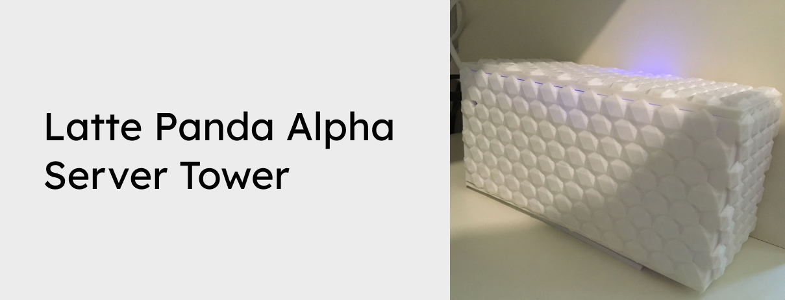

Use your Latte Panda Alpha and some HDDs and 3D print your own server!

Want to support the development and stay updated?

 

## Instrutions
Print the .stl files with your 3D printer, place the HDDs/SSDs in the bottom two compartments and the Latte Panda Alpha in the top compartment (with fan up, for the best airflow). If you want to customize the 3D model - you can clone it on Tinkercard: [https://www.tinkercad.com/things/dHE0WsErtYS](https://www.tinkercad.com/things/dHE0WsErtYS)